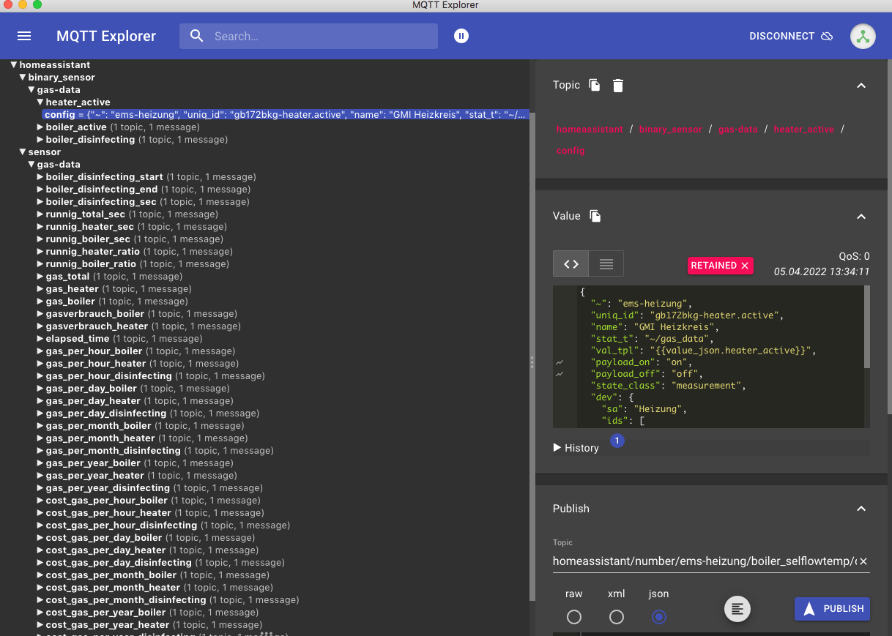

# ha-mqtt-discovery
A library that provides tools to simplify MQTT discovery implementation for Home Assistant to your device.



## Generate MQTT entities in Home Assistant
1. Create `devices/ha/DEVICENAME/discovery.yaml``
2. Optional add additional discovery items schema to `devices/ha/DEVICENAME/schemalist.yaml`
3. Add device and sourcfolder to `config.py`
4. Run `python3 app.py`


```python
from lib import logger
from conf import *
from lib.ha_discoveryitems import *

log = logger.Log(__name__, LOG_LEVEL)

if __name__ == "__main__":
    """simple testcase to create and publish ha mqtt discovery items"""
    for device in DEVICES:
        print(device["device"])
        hadis = haDiscoveryItems(devicename=device["device"], folder=device["source"])
        n  = hadis.publish()
        log.info("HA Discovery {} Items: {}".format(device["device"], n))
```

<hr>

## Info
>>
https://github.com/plapointe6/HAMqttDevice<br>
https://github.com/shaonianzhentan/node-red-contrib-ha-mqtt<br>
https://flows.nodered.org/node/node-red-contrib-ha-mqtt<br>
https://webworxshop.com/home-assistant-mqtt-discovery-sensors-in-node-red/<br>
https://roelofjanelsinga.com/articles/mqtt-discovery-with-an-arduino/<br>

<hr>
